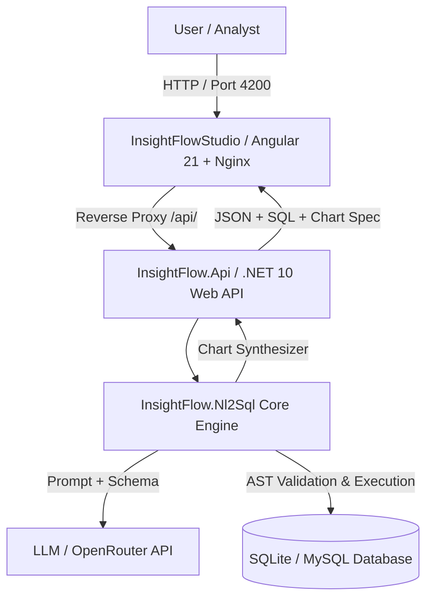

# InsightFlow

> **Production-grade Natural Language to SQL (NL2SQL) Engine, Web API, and Interactive Studio.**

InsightFlow transforms natural language questions into safe, optimized SQL queries, executes them against relational databases, and automatically suggests visual data charts. Built with .NET 10 and Angular 21, it includes AST guardrails, column-level data masking, and multi-database support out of the box.

---

##  System Architecture



---

## Project Components

InsightFlow is structured as a clean, modular monorepo:

| Project | Type | Description | README |
| :--- | :--- | :--- | :--- |
| [**InsightFlow.Nl2Sql**](./InsightFlow.Nl2Sql) | .NET 10 Library | Core NL2SQL engine SDK with AST guardrails, schema extractors, and column masking. | [SDK Docs](./InsightFlow.Nl2Sql/README.md) |
| [**InsightFlow.Api**](./InsightFlow.Api) | ASP.NET Core API | RESTful Web API service with database seeding, CORS policies, and OpenAPI docs. | [API Docs](./InsightFlow.Api/README.md) |
| [**InsightFlowStudio**](./InsightFlowStudio) | Angular 21 App | Modern, dark-mode web application for executing NL queries, reviewing SQL, and visualizing data. | [Studio Docs](./InsightFlowStudio/README.md) |

---

## Quick Start with Docker (Recommended)

Run the entire InsightFlow stack on any machine with Docker installed in seconds:

### 1. Clone & Configure Environment
```bash
git clone https://github.com/your-org/InsightFlow.git
cd InsightFlow
cp .env.example .env
```

Set your OpenRouter / OpenAI API key in `.env`:
```env
NL2SQL_API_KEY=your_openrouter_api_key_here
NL2SQL_MODEL_NAME=openai/gpt-4o-mini
```

### 2. Launch Services
```bash
docker compose up --build -d
```

### 3. Access Applications
- **InsightFlow Studio (Web Interface):** [http://localhost:4200](http://localhost:4200)
- **InsightFlow API (Swagger UI):** [http://localhost:5182/swagger](http://localhost:5182/swagger)

---

##  Local Development Setup

If you prefer running services individually outside of Docker:

### Prerequisites
- [.NET 10 SDK](https://dotnet.microsoft.com/download/dotnet/10.0)
- [Node.js (v20+)](https://nodejs.org/) & `npm`

### 1. Run Web API
```bash
cd InsightFlow.Api
dotnet run
```
API runs at `http://localhost:5182`.

### 2. Run Studio Frontend
```bash
cd InsightFlowStudio
npm install
npm start
```
Studio runs at `http://localhost:4200`.

### 3. Run Library Tests
```bash
dotnet test InsightFlow.Nl2Sql.Tests
```

---

##  Security & Guardrails

- **AST Mutation Blocking:** Enforces read-only execution. Destructive queries (`DROP`, `DELETE`, `UPDATE`, `ALTER`, `INSERT`) are rejected before hitting the database.
- **Column-Level Masking:** Sensitive columns (e.g., `PasswordHash`, `CreditCardNumber`) are filtered out of prompt context and sanitized from response payloads.
- **SQL Injection Prevention:** Parameterized queries and statement delimiter blocking prevent multi-statement injection attacks.
- **Limit Enforcement:** Automatically injects `LIMIT N` caps to protect memory and prevent huge result sets from locking database tables.

---

## License

This project is licensed under the MIT License.
