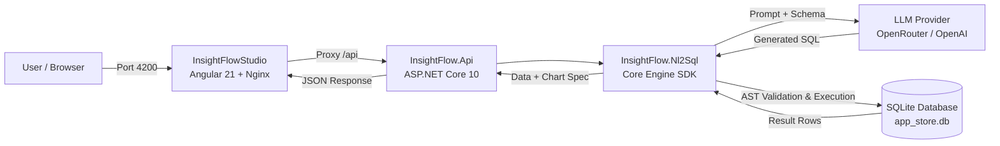
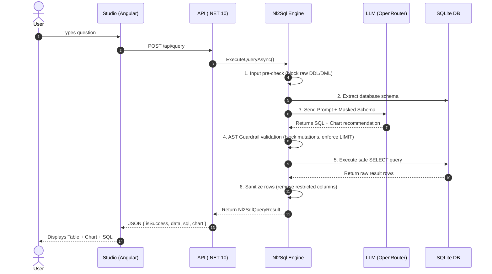

# InsightFlow - Technical Documentation

> **Simple, high-level technical guide for developers and contributors.**

---

## 1. Overview

**InsightFlow** is a natural language to SQL (NL2SQL) platform. It allows users to ask questions in plain English (e.g., *"What are the top 5 selling products this month?"*), automatically generates safe SQL queries, executes them against a database, and visualizes the results as tables and charts.

### Key Goals
- **Natural Language Querying:** Translate human language into valid SQL using LLMs (OpenRouter / OpenAI).
- **Safety First:** Block dangerous mutations (`DROP`, `DELETE`, `UPDATE`) using SQL AST (Abstract Syntax Tree) validation.
- **Privacy & Masking:** Mask sensitive columns (e.g., credit cards, password hashes) before sending schemas to the LLM and before returning results.
- **Automatic Visualizations:** Automatically suggest and render charts (bar, line, pie) based on query output.

---

## 2. High-Level Architecture

The project is built as a modular monorepo:



---

## 3. Project Structure & Components

| Component | Technology | Description |
| :--- | :--- | :--- |
| **`InsightFlow.Nl2Sql`** | .NET 10 Class Library | Core engine SDK containing schema extractors, prompt synthesis, AST guardrails, and query executors. |
| **`InsightFlow.Api`** | ASP.NET Core 10 Web API | REST API exposing endpoints, loading configurations, and seeding the local SQLite store database. |
| **`InsightFlowStudio`** | Angular 21 + Nginx | Web interface with dark mode, query history, SQL viewer, data tables, and dynamic charts. |
| **`InsightFlow.Nl2Sql.Tests`** | xUnit / .NET 10 | Unit and integration test suite verifying guardrails, schema extraction, and synthesis logic. |

---

## 4. Query Execution Lifecycle

When a user asks a question in the UI, the request flows through these 7 simple steps:



### Detailed Steps:
1. **Input Pre-Check:** Rejects prompt upfront if it begins with raw destructive SQL commands (`DROP`, `DELETE`, `UPDATE`, `ALTER`).
2. **Schema Extraction:** Inspects tables, columns, and data types (filtering out restricted columns).
3. **AI Synthesis:** The LLM generates a read-only `SELECT` query along with a chart recommendation (type, x-axis, y-axis).
4. **AST Guardrail Validation:** Parses SQL syntax tree to guarantee:
   - Only `SELECT` statements are executed.
   - Multi-statement queries or chained commands are blocked.
   - Enforces a maximum row limit (default: 50 rows).
5. **Execution:** Runs the validated query against the database with a strict timeout (15 seconds).
6. **Data Masking:** Removes any sensitive columns from the final result set.
7. **Response Delivery:** Returns structured JSON containing data rows, generated SQL, and chart metadata to the frontend.

---

## 5. Security & Safety Guardrails

| Guardrail | How It Works |
| :--- | :--- |
| **Read-Only AST Validation** | Uses SQL parser to ensure only read queries run. Any mutation statement (`INSERT`, `UPDATE`, `DELETE`, `DROP`, `TRUNCATE`) causes an immediate rejection. |
| **Row Limit Injection** | Automatically appends or caps `LIMIT N` on queries to prevent memory exhaustion and database lockups. |
| **Query Timeout** | Queries abort automatically if execution takes longer than 15 seconds. |
| **Column Masking** | Prevents sensitive columns (`PasswordHash`, `CreditCardNumber`) from ever being exposed to the AI prompt or frontend output. |
| **Parameterized Connection Strings** | Allows running against different databases securely without hardcoding credentials in queries. |

---

## 6. API Specification

### Endpoint: `POST /api/query`

**Request Body:**
```json
{
  "prompt": "Show top 5 customers with the highest total spent",
  "connectionString": null,
  "restrictedColumns": [
    "Customers.PasswordHash",
    "Customers.CreditCardNumber"
  ]
}
```
*Note: If `connectionString` is omitted or null, the API uses the pre-seeded SQLite database.*

**Successful Response (200 OK):**
```json
{
  "isSuccess": true,
  "data": [
    { "CustomerName": "Alice Johnson", "TotalSpent": 1250.50 },
    { "CustomerName": "Bob Smith", "TotalSpent": 980.00 }
  ],
  "sql": "SELECT c.Name AS CustomerName, SUM(o.TotalAmount) AS TotalSpent FROM Customers c JOIN Orders o ON c.Id = o.CustomerId GROUP BY c.Id ORDER BY TotalSpent DESC LIMIT 5;",
  "chart": {
    "type": "bar",
    "xAxis": "CustomerName",
    "yAxis": "TotalSpent",
    "title": "Top Customers by Spend"
  }
}
```

**Error Response (400 Bad Request):**
```json
{
  "isSuccess": false,
  "error": "Security Violation: Non-SELECT statements are not allowed.",
  "sql": "DROP TABLE Customers;"
}
```

---

## 7. Configuration & Environment Variables

All settings are configured via environment variables or [.env](file:///Users/karanvishwakarma/code/InsightFlow/.env):

| Variable | Required | Default | Description |
| :--- | :--- | :--- | :--- |
| `NL2SQL_API_KEY` | **Yes** | — | OpenRouter or OpenAI API key. |
| `NL2SQL_BASE_URL` | No | `https://openrouter.ai/api/v1` | LLM API endpoint base URL. |
| `NL2SQL_MODEL_NAME` | No | `openai/gpt-4o-mini` | Model used for query synthesis. |
| `ASPNETCORE_ENVIRONMENT` | No | `Production` | ASP.NET runtime environment mode. |

---

## 8. Running the Application

### Option A: Using Docker (Recommended)
```bash
# 1. Ensure .env has your API key
cp .env.example .env

# 2. Build and launch all services
docker compose up --build -d
```
- **Studio UI:** [http://localhost:4200](http://localhost:4200)
- **API & Swagger:** [http://localhost:5182/swagger](http://localhost:5182/swagger)

### Option B: Running Locally (Without Docker)

1. **Run the API:**
   ```bash
   cd InsightFlow.Api
   dotnet run
   ```
2. **Run the Frontend Studio:**
   ```bash
   cd InsightFlowStudio
   npm install
   npm start
   ```
3. **Run Unit Tests:**
   ```bash
   dotnet test InsightFlow.Nl2Sql.Tests
   ```
